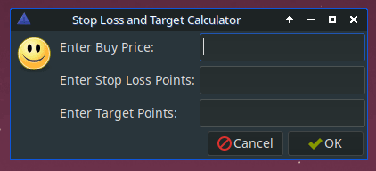
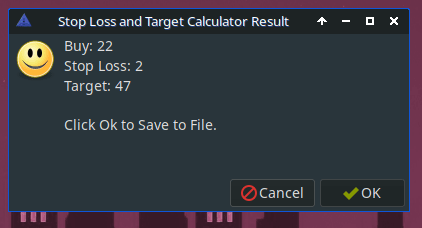

# Stop Loss Target

## About the Application

Stop Loss Target is a desktop application designed to provide a quick and efficient way to calculate your day trading quotes. It also offers integration with Conky, a popular system monitor for Linux.

## Getting Started

To get started with Stop Loss Target, you can:

1. Clone the [original project](https://github.com/somen3/stoploss-target?fbclid=IwAR3HerxXX59-QH8Qmm0hCT7Gfz7zfBWS26tQ1cduwkQ99-0VycaFpChjt-s) by the original author, Somen Nharracharjee.

2. There are no install instrutions or Debian installer, copy the files to the persective directory.  

3. Run the application and start calculating your day trading quotes.

## License

This project is licensed under the MIT License - see the [LICENSE](LICENSE) file for details.

## Acknowledgments

- Original Author: Somen Nharracharjee
- Original Project: [GitHub Repository](https://github.com/somen3/stoploss-target?fbclid=IwAR3HerxXX59-QH8Qmm0hCT7Gfz7zfBWS26tQ1cduwkQ99-0VycaFpChjt-s)

Feel free to contribute to the project or report any issues you encounter. Happy day trading!
